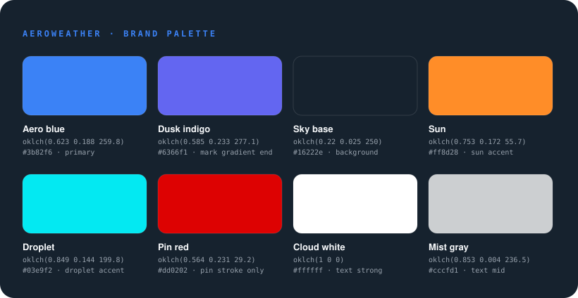

<p align="center">
  
</p>

# AeroWeather

**Live: <https://aero-weather-nightservants-projects.vercel.app>**

A modern weather web app built with Next.js 16 (App Router, Turbopack) and React 19. AeroWeather shows current conditions and a two-week outlook for any city in the world, presented as a single scrolling page with a dark glassmorphic interface and weather-driven gradient palettes.

## 1. App Overview

AeroWeather is a single-page weather dashboard that runs entirely in the browser. There is no account and no backend of its own. All preferences (saved cities, units, time format) live in `localStorage` on the device. Anonymous, cookieless page counts are collected; Google Analytics is opt-in and stays off until you allow it (see [Privacy and analytics](#6-privacy-and-analytics)). Weather, air quality, and geocoding data are fetched on demand from Open-Meteo's three public, key-less endpoints (Forecast, Geocoding, Air Quality).

The interface is one continuously scrolling page of three anchor-linked sections:

- **Today** — current conditions plus detail cards (air quality, UV index, sunrise, sunset, humidity/dew point) for the active city.
- **2-Week** — a "Next 24 hours" hourly rail, the 14-day outlook, and summary cards.
- **Locations** — summary cards, tabbed Saved / Suggested carousels, and a per-place details dialog with description, photo gallery, and interactive map.

Settings, the FAQ, and the privacy policy are standalone routes (`/settings`, `/faq`, `/privacy`) rather than more of that scroll, so a session ends where the weather ends instead of in preference controls nobody asked for.

A sticky top navbar carries the three anchors plus **Settings**, and highlights the section currently in view. Below `lg` the links collapse behind one menu and the bar reads menu, search, locate from left to right — the menu on the edge the thumb reaches, the field in the middle. That menu holds every destination, each row led by its own icon; it leaves out Search, because the field sitting beside it already is the search. FAQ and Privacy live there and in the footer.

AeroWeather is designed to be free for everyone — no sign-up, no rate limits surfaced to the user, no premium tier.

## 2. Brand

### Icon

The AeroWeather mark is a white cloud with three rain strokes on a rounded square filled with the brand gradient (`#3b82f6` → `#6366f1`, top-left to bottom-right, 11px corner radius at 40×40).

| Asset | Purpose |
|---|---|
| [`public/brand/aero-logo.svg`](public/brand/aero-logo.svg) | Canonical brand mark — use this in docs and external material |
| [`app/icon.svg`](app/icon.svg) | The same mark wired into Next.js as the favicon / app icon |

The mark is a single SVG and scales to any size; don't recolor the gradient or remove the rain strokes.

### Color palette

<p align="center">
  
</p>

AeroWeather is dark-only. Tokens are authored in OKLch in [`app/globals.css`](app/globals.css); the hex values below are the sampled equivalents recorded in [`DESIGN-SPEC.md`](DESIGN-SPEC.md) (the binding design contract).

| Token | Hex | OKLch | Used for |
|---|---|---|---|
| `--primary` | `#3b82f6` | `oklch(0.623 0.188 259.8)` | The one accent blue: hero temperature, headlines, active tab/nav |
| brand gradient end | `#6366f1` | — | Second stop of the logo-mark gradient only |
| `--background` | `#16222e` | `oklch(0.22 0.025 250)` | Sky-base page color behind the photo layer |
| `--accent-sun` | `#ff8d28` | `oklch(0.753 0.172 55.7)` | Sun icon fill/stroke, day forecast icons |
| `--accent-droplet` | `#03e9f2` | `oklch(0.849 0.144 199.8)` | Humidity/dew droplet strokes, precipitation |
| `--accent-pin` | `#dd0202` | `oklch(0.564 0.231 29.2)` | Map-pin icon stroke only — never text |
| `--text-strong` | `#ffffff` | `oklch(1 0 0)` | Stat values and card titles (large text only) |
| `--text-mid` | `#cccfd1` | `oklch(0.853 0.004 236.5)` | Secondary values, footer links |

Beyond these fixed brand colors, the hero surface carries one of seven weather-driven **sky palettes** (sunny, sunset, rainy, stormy, cloudy, snowy, night), defined as `[data-palette="…"]` gradient tokens in `app/globals.css` and selected automatically from the active city's conditions. Full token definitions, spacing, and typography live in `DESIGN-SPEC.md`.

## 3. Features

### Inline location search
The top-bar search field is a real input, not a button. Typing immediately runs a debounced geocoding query against Open-Meteo's geocoding API and renders results in an opaque dropdown directly under the input. Saved cities appear in the dropdown when the query is empty. `⌘K` / `Ctrl+K` focuses the field from anywhere. Below `md` a dropdown over a phone-width bar would cover the very list it is filtering, so the field hands off to a full `/search` route instead: same query, same results, given the whole screen.

### Today section
- Greeting header with a plain-language summary of the day for the active city, written short on purpose: from `lg` it sits beside the detail rail, where a longer line wrapped and pushed the temperature down the page.
- Any active weather alert surfaces in an alert card at the top.
- Hero block with the temperature, weather summary, "feels like / high / low" line, and a weather-driven gradient scene (animated sun, clouds, rain droplets, snowflakes, lightning, or moon depending on conditions).
- The readings around the temperature are held to one line each. From `lg` the hero shares its row with the detail rail, which leaves those cells about 265px wide: the dateline abbreviates its month, and a condition too long for the cell ends in an ellipsis rather than running under the reading beside it.
- Detail cards: **Air Quality** (US AQI with a banded dial), UV Index, Sunrise and Sunset, and Humidity (with dew point) — all timezone-correct for the selected city.
- The cards are a grid at every width (two up on phones, no horizontal scroller), and the temperature is the largest element on the page rather than the greeting.

### 2-Week Outlook
A single scrolling section (no layout switcher):
- **Next 24 hours** — an hourly rail of temperature and conditions.
- **14-day outlook** — one row per day on phones and tablets (weekday, date, condition, precipitation chance, high/low), so nine or ten days are readable at once; from `lg` the same data becomes a carousel you drive with prev/next buttons. (Open-Meteo provides up to 16 days of daily forecast.)
- **Summary cards** — cumulative rain total, peak wind, temperature range over the period, and any active weather alerts.

### Locations
- **Summary cards** — at-a-glance metrics across your saved places: total saved, active location, average temperature, and how many are seeing rain right now. Left accent border on desktop, bottom accent on mobile (matching the 2-Week and Settings sections). Saved and Active run the full width below `sm`: both carry text of no fixed length, and a half-width column at 320px broke a place name across two lines mid-word. The two numeric metrics stay side by side, where short values keep the density worth having.
- **Saved / Suggested tabs** — a tabbed pair of carousels. *Saved* holds your places; *Suggested* offers a curated set of popular cities, filtered to hide anything you already track.
- Each card shows a hero photo, name, region, live weather icon, temperature, and condition. Nothing sits on top of the photo: the whole card is the target that opens its details, so the badge that used to mark the corner was decoration over the one element already doing the most work. Country-level places fall back to a gradient tile instead of a flag.
- **Location details dialog** — opens from anywhere on a card. A centred dialog from `md`, and a drag-to-dismiss bottom sheet below it, where a centred box would waste the width. A hero header with a current-weather badge, a short overview (Wikipedia), a photo gallery (Wikimedia Commons) with a full-screen lightbox (prev/next + keyboard nav), an interactive **OpenStreetMap / Leaflet** map with a satellite toggle and an "Open in Google Maps" link, and metadata (coordinates, elevation, time zone, sunrise, sunset). The map, gallery, and description load only when the dialog opens.
- From a saved place's dialog you can **View forecast** (makes it the active location and jumps to Today) or **Remove** it. From a suggested place you can **Save** it — which animates it into your saved list and updates the summary cards instantly.
- Add new cities via the **+** button (opens a search dialog) or via the top-bar search.

### FAQ, privacy page, and SEO
Five questions answer the things people actually ask (accounts, data sources, the
14-day horizon, where saved cities live, geolocation accuracy). A real `/privacy`
page names every third party that receives a request from your browser. The app
also ships `robots.txt`, `sitemap.xml`, a generated Open Graph image, and a custom
404 page.

### Weather-driven palettes
Seven palettes — sunny, sunset, rainy, stormy, cloudy, snowy, night — each with weather-appropriate gradient hues, scene accent colors, and a `--hero-text` token that auto-selects a readable foreground. Palettes are tuned in chroma and lightness for the dark interface so hero cards sit quietly against the dark surface instead of glowing. The active palette is derived from the current conditions of the selected city.

### Glassmorphism + dark chrome
All surface cards use a semi-transparent background, a 1px strong-hairline border, and a backdrop blur. The base color system is a dark blue/slate palette — only the weather hero gradients carry weather hue.

### Use-my-location
The map-pin button at the right end of the top bar requests the browser's geolocation, reverse-geocodes the coordinates via Open-Meteo, and adds the resolved place to your saved cities as the active location. It is the one control the bar drops below 360px, where the search field needs the width more; the footer's **Use my location** link runs the same handler.

### Units & locale
- Temperature: °C / °F
- Wind: km/h, mph, m/s
- Time format: 12h / 24h
- First day of week: Sun / Mon (used by the forecast grid)

### Notifications panel
Toggle rows for push permission, severe-weather alerts, daily morning briefing, and "rain starting soon" heads-up. (UI toggles persist locally; actual delivery requires a service worker which is not configured by default.)

### Local-first preferences
Every preference — units, time format, notifications, saved cities, active city — is stored in `localStorage` under the key `aero.prefs.v1`. Changes are broadcast to all open tabs via the `storage` event. Clearing site data wipes the app's state.

## 4. Localhost Installation

AeroWeather requires **Node.js 20.9+** (Node 20 LTS or newer recommended, per Next.js 16) and **npm**.

```bash
git clone <repository-url> weather_app
cd weather_app

npm install
npm run dev
```

The dev server (Turbopack) starts at <http://localhost:3000>. Open it and you'll land on the Today section with the default city until you search for or geolocate your own.

Other scripts:

```bash
npm run build          # production build
npm start              # serve the production build
npm run lint           # eslint
npm test               # vitest, single run
npm run test:watch     # vitest, watch mode
npm run test:coverage  # vitest with a V8 coverage report
```

Tests cover the pure logic in `lib/` (formatting, preferences, forecast summaries,
AQI bands, section and outlook helpers). Date and time formatting is timezone
sensitive, so run those under a non-UTC zone when changing them — the bug they guard
against is invisible when the machine's zone matches the city's:

```bash
TZ=Asia/Manila npm test
```

Two things in the shell look decorative and are not, each of which cost a
debugging round. `data-scroll-behavior="smooth"` on `<html>` in
[`app/layout.tsx`](app/layout.tsx) is what keeps route navigation instant: this
app sets `scroll-behavior: smooth` in CSS for its anchor nav, and Next 16 no
longer overrides that during a route change the way Next 15 did, so without the
attribute every navigation animates the full scroll distance. And
[`components/shell/scroll-to-top.tsx`](components/shell/scroll-to-top.tsx)
covers what the attribute does not: the browser carries the old scroll offset
across a client-side navigation and clamps it to the new page's height, and Next
skips its own scroll-to-top when the result leaves the incoming content
technically in view — which parked `/faq` 176px down with its heading behind the
navbar, while taller routes escaped it by luck. It deliberately stands aside for
hash targets and for back/forward, so anchors and restored positions still work.

One more of the same kind, in the details sheet. Vaul ships its height as
`data-[vaul-drawer-direction=bottom]:max-h-[80vh]`, and a plain `max-h-*`
utility passed to `DrawerContent` loses to that attribute selector on
specificity — silently, so the sheet had been 80vh for as long as there had
been a number there saying otherwise. Height overrides on that component have
to be written through the same variant. Give the sheet's body its own second
cap on top of that and the two disagree: the taller one wins, nothing clips
the overflow, and the footer hangs below the bottom of the screen with the
actions on it. One cap per surface, and in `dvh` rather than `vh`, since
`100vh` on Android measures the viewport with the browser chrome retracted.

Open-Meteo's APIs are key-less and open, so the app runs with no configuration at all.
Two optional variables affect deployment only — see below.

## 5. Configuration

Both are optional; the app runs without them.

| Variable | Effect when unset |
|---|---|
| `NEXT_PUBLIC_SITE_URL` | The origin is inferred: from `VERCEL_PROJECT_PRODUCTION_URL` on Vercel, `VERCEL_BRANCH_URL` on a preview, `http://localhost:3000` otherwise. Set it for a custom domain, or wherever inference does not work (see Deployment). |
| `NEXT_PUBLIC_GA_ID` | Google Analytics stays dormant and the consent prompt never appears. Set a `G-XXXXXXXXXX` measurement id to enable the opt-in flow. |

Both are read at build time, so a change to either needs a redeploy rather than
just a new value: every route is prerendered and the origin is baked into
`robots.txt`, `sitemap.xml`, and the Open Graph tags.

### Deployment

Vercel is the better fit. The build is fully static (every route prerendered, no
server rendering, no database), and the Next.js 16 metadata routes this app uses
— `opengraph-image`, `robots`, `sitemap` — are first-party there rather than
going through a compatibility layer. Import the repo and deploy; with the CLI
linked, `vercel --prod` deploys from the working copy.

Three things about the current deployment are worth knowing, each of which cost
a debugging round to find:

- **`NEXT_PUBLIC_SITE_URL` is set in Production and needs to stay set.**
  `VERCEL_PROJECT_PRODUCTION_URL` is not exposed in this project's builds, so
  without the override the origin resolves to `http://localhost:3000` and that
  gets baked into `robots.txt`, the sitemap, and the Open Graph tags. Removing
  the project's broken custom domain did not change this, so the domain was not
  the cause.
- **Deployment Protection has to stay disabled while the app is on a
  `.vercel.app` address.** Standard Protection exempts custom production
  domains, not generated Vercel URLs, so with no custom domain it puts the
  whole public site behind an SSO redirect, `robots.txt` included. Re-enable it
  once a custom domain exists, and check the result with an unauthenticated
  `curl` rather than trusting the setting's name.
- **The site cannot be indexed yet.** Vercel serves `x-robots-tag: noindex` on
  every `.vercel.app` URL, and a response header overrides `robots.txt`. Only a
  custom domain lifts it. Link previews are unaffected: they read the Open Graph
  tags and ignore that header.

After any change to either variable, verify rather than assume:

```bash
curl -s https://YOUR-DOMAIN/robots.txt   # the Sitemap: line must name your domain
```

## 6. Privacy and analytics

- Preferences and saved cities are stored in one `localStorage` key and never leave the device.
- **Vercel Analytics** records anonymous page views. It sets no cookies and assigns no identifier, so it runs without a prompt.
- **Google Analytics is opt-in.** Nothing from Google loads unless you press Allow, and declining keeps it off permanently on that device.
- Weather, geocoding, and imagery requests go straight from your browser to Open-Meteo, BigDataCloud, and Wikimedia, so each of those necessarily sees your IP address. The [`/privacy`](app/(app)/privacy/page.tsx) page names what reaches whom.
- No AI is used to generate, personalise, or process anything in the app.

## 7. Limitations

- **Forecast horizon** — daily forecasts are capped at 16 days by Open-Meteo, and the 2-Week section shows 14 of them. There is no true "monthly" outlook.
- **No backend / no account** — preferences and saved cities live in `localStorage` only. Clearing site data, switching browsers, or using private/incognito windows resets the app.
- **Notifications are toggles only** — the Notifications section persists user intent, but AeroWeather ships without a service worker, so no push notifications are actually delivered.
- **Geolocation accuracy** — "Use my location" uses the browser's coarse geolocation with an 8-second timeout. Indoor or VPN-affected positions can resolve to a nearby city rather than your exact spot.
- **Network-dependent** — data is fetched from Open-Meteo on load and on city change. Offline use is not supported; there is no cache layer beyond the browser's HTTP cache.
- **Rate limits** — Open-Meteo's free tier is generous but not infinite. Rapidly switching cities or hammering search may temporarily return HTTP 429.
- **Air-quality coverage** — the US AQI card reads from Open-Meteo's air-quality endpoint, whose coverage is uneven outside major regions. The card is hidden when no reading is returned.
- **Time zones** — display uses the selected city's IANA timezone. Open-Meteo returns times already localised to that city and without an offset, so they are formatted as wall-clock readings rather than re-converted; see `resolveInstant` in [`lib/format.ts`](lib/format.ts). Cities without a confident timezone fall back to UTC.
- **Accessibility** — keyboard navigation works for primary controls (search input, nav links, toggles), but a full screen-reader pass has not been done. `prefers-reduced-motion` and `prefers-reduced-transparency` are both honoured in `globals.css`.
- **Browser support** — `backdrop-filter` (used for glassmorphism) requires a recent Chromium, Safari 15+, or Firefox 103+. Older browsers will render the cards as opaque surfaces.
